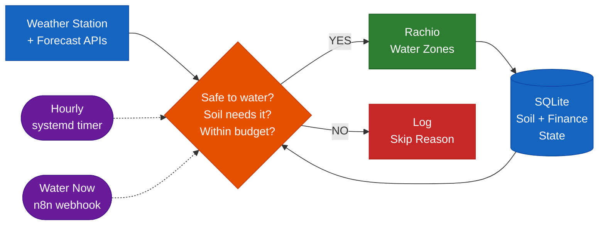

# Smart Water System

Standalone irrigation controller that takes over scheduling for a Rachio sprinkler system using your own weather station data, ET-based soil moisture modeling, and multi-day forecasting. Gives you full control over the decision logic that Rachio keeps behind its app.

## How It Works



## What it does

Every hour, the system checks whether your lawn needs water by running a five-stage decision pipeline:

1. **Safety** - Skip if wind is too high, it rained recently, or temps are below freezing
2. **Forecast** - Skip if significant rain is predicted in the next 24 hours
3. **Soil moisture** - Calculate per-zone water deficit using evapotranspiration (ET) modeling with data from your personal weather station
4. **Budget** - Enforce daily gallon and cost limits based on your tiered water rates
5. **Scheduling** - Build an optimized run with smart soak cycles for clay soil infiltration

If watering is needed, the system sends the command to Rachio, verifies it was accepted, and updates all state. If not, it logs the skip reason and moves on.

## What Rachio already does (and where it falls short)

Rachio 3 includes solid smart watering at no recurring cost. No subscription required. Here's what's free, what's paid, and what the community reports about how well each feature actually works:

| Feature | Availability | Real-World Issues |
|---------|-------------|-------------------|
| **Flex Daily** (ET-based scheduling) | Free, Rachio 3 only | Works well in mild climates with standard soil. Documented failures in extreme heat (Phoenix users report 8-day gaps during 100F+) and non-standard soil. Highly sensitive to precipitation rate calibration - without catch cup testing, users report 20-hour schedules or mushroom-growing over-watering. Many users give up and revert to fixed schedules. |
| **Weather Intelligence** (rain/wind/freeze skip) | Free, all models | The most-complained-about feature. Documented cases of watering during active heavy rain, applying saturation skips to dry yards, and showing 0.14" when local gauges read 0.35". Has a timing blind spot - rain that starts within the final hour before a scheduled run does not trigger a skip. Silently uses stale data when nearby PWS stations go offline. |
| **Cycle and Soak** | Free, all models | Generally works but inconsistently activates - some zones get it, others in the same schedule don't. Users report zones extending from 8 to 46 minutes without clear explanation in the app. |
| **PWS support** | Free, all models | Rachio 3 routes PWS data through Aeris Weather aggregation rather than reading stations directly. This adds lag and a fragile dependency chain (station -> CWOP/PWSWeather -> Aeris -> Rachio). No alerting when a nearby station goes offline - the system silently falls back to less accurate data. |
| **Weather Adjust** (proactive heat/cool wave) | $29.99 one-time | Applies percentage-based boosts during heat waves (default: +20% at 105F for 2+ days). Community reaction was strongly negative - users describe it as a paywall on what should be core functionality. Redundant if you already use Flex Daily. |
| **Cloud dependency** | Required | No local control path. If your internet goes down, the controller runs its last cached schedule. Cannot be modified or manually triggered without cloud connectivity. Rain Bird acquired Rachio in October 2025, raising concerns about long-term API and service continuity. |

## What this system does differently

This project exists because Rachio's smart features are opaque, cloud-dependent, and fragile in the specific ways documented above. It takes full control of the decision engine and addresses each of those failure modes:

- **Direct weather station reads.** Pulls data from your Ambient Weather station via API. No PWSWeather aggregation chain, no Aeris middleman, no silent fallback to distant stations. If the station is offline, the system knows immediately and falls back explicitly rather than silently degrading.

- **Transparent decisions.** Every run is logged with full reasoning in SQLite: which zones needed water, how much deficit each had, what the ET calculation was, why others were skipped, what the forecast said. You can query exactly why any decision was made. Rachio's app shows what happened but not the full decision chain.

- **Multi-day ET projection.** Projects soil moisture balances forward using OpenMeteo's 4-day forecast, watering before a predicted deficit rather than during one. Rachio's Weather Adjust ($29.99) does simple percentage boosts at fixed thresholds - this does per-zone ET projection across every forecast day.

- **Reliable in extreme heat.** The emergency cooling system uses dynamic temperature triggers adjusted for solar radiation, humidity, and wind. Where Rachio's Flex Daily has documented 8-day watering gaps during 100F+ heat in rocky soil, this system's degraded-mode policy ensures it will never skip watering in summer because a data source is unavailable. Conservative defaults (assume 85F, 30% humidity, no rain) activate automatically when APIs go stale.

- **Cost-aware.** Calculates actual water costs against tiered utility rate structures, enforces daily gallon and dollar budgets, and tracks cumulative billing cycle usage. Rachio has no cost modeling.

- **Fully local.** Runs on your own hardware with SQLite. No cloud required for decision-making. The only external dependencies are the weather APIs (with fallbacks) and the Rachio API itself (for sending commands to the controller hardware). If the Rain Bird acquisition eventually deprecates the Rachio cloud, the decision engine and all historical data remain intact on your server.

## Key features

**Shadow mode.** Before going live, the system runs in shadow mode - makes all decisions and logs them, but doesn't actually send commands to Rachio. Run for a week to validate decisions before activating.

**Decision-Command-Verify.** Every watering run is logged in three phases. The decision is recorded before any command is sent. If Rachio rejects the command or doesn't respond, state is not corrupted.

**Watchdog.** A separate systemd timer runs at 2am (one hour after the daily watering window closes). If no successful run was logged in the past 24 hours during growing season, it sends an alert.

**Dormant fallback.** A basic fixed schedule stays configured in the Rachio app on standby. If the homelab goes down entirely, manually activating this schedule provides emergency coverage.

## Project structure

```
src/
  cli.js              Entry point - handles run/water/status/cleanup commands
  config.js            All configuration (zone profiles, thresholds, rates)
  weather.js           Weather data coordinator with degraded-mode fallback
  watchdog.js          Missed-run alert checker
  log.js               Structured logger for systemd journal
  core/
    et.js              Evapotranspiration calculations (Hargreaves variant)
    soil-moisture.js   Per-zone moisture balance tracking
    rule-engine.js     5-stage decision engine
    soak.js            Smart soak cycle builder
    finance.js         Tiered cost calculations
  api/
    rachio.js          Rachio API client
    ambient.js         Ambient Weather API client
    openmeteo.js       OpenMeteo API client
    http.js            Shared fetch with retry
  db/
    schema.sql         SQLite table definitions
    state.js           All database read/write operations
tests/                 34 tests covering core logic
deploy/
  smart-water.service  systemd oneshot service
  smart-water.timer    Hourly timer
  smart-water-watchdog.service
  smart-water-watchdog.timer
  install.sh           Deployment script
  n8n-workflows/       n8n integration design
```

## Requirements

- Node.js 20+
- SQLite (via better-sqlite3)
- Rachio irrigation controller
- Ambient Weather station (optional but recommended)
- systemd (for scheduling)
- n8n (optional, for notifications and manual triggers)

## Setup

```bash
# Clone and install
git clone <repo-url> ~/smart-water
cd ~/smart-water
npm install --production

# Configure
mkdir -p ~/.smart-water
cp .env.example ~/.smart-water/.env
chmod 600 ~/.smart-water/.env
# Edit ~/.smart-water/.env with your API keys

# Test in shadow mode
node src/cli.js run --shadow

# Check status
node src/cli.js status

# Install systemd timers
bash deploy/install.sh

# View logs
journalctl -u smart-water -f
```

## Commands

| Command | Description |
|---------|-------------|
| `node src/cli.js run` | Run the hourly decision cycle |
| `node src/cli.js run --shadow` | Run in shadow mode (no Rachio commands) |
| `node src/cli.js water` | Manual watering trigger (respects safety checks) |
| `node src/cli.js status` | Show current moisture levels, usage, and last run |
| `node src/cli.js cleanup` | Remove data older than 90 days |

## Configuration

All zone profiles, thresholds, and rates are in `src/config.js`. API keys and secrets are in `~/.smart-water/.env`. See `.env.example` for all available environment variables.

## Zone profiles

The system manages 9 zones - 6 lawn (rotor heads) and 3 drip. Each zone has independently configured sun exposure, area, soil profile, and priority. Soil chemistry (organic matter, pH) modifies available water capacity for more accurate deficit calculations.
