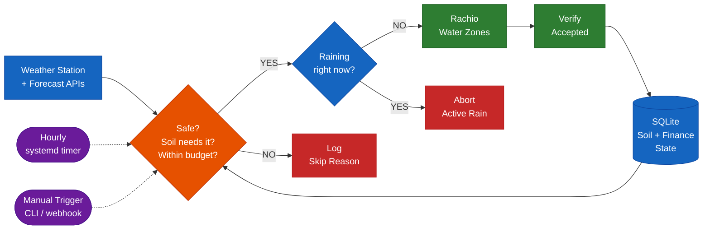
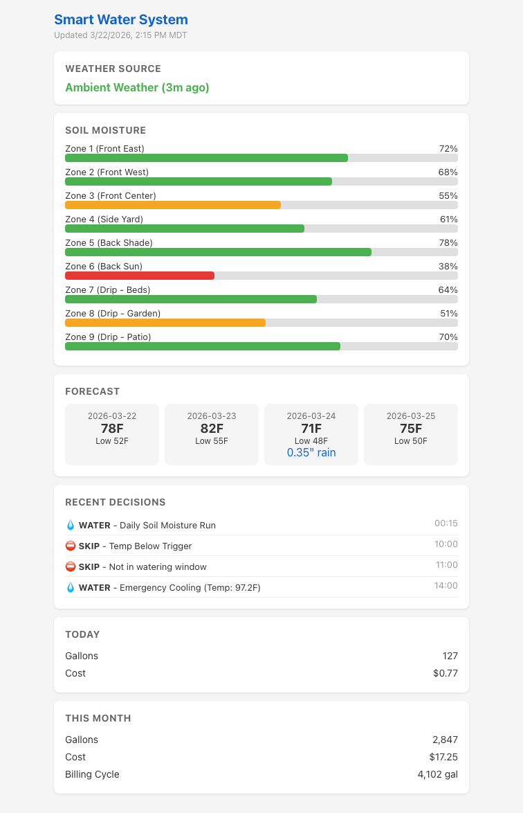

# Smart Water System

Standalone irrigation controller that takes over scheduling for a Rachio sprinkler system using your weather station data plus forecast/archive weather APIs, ET-based soil moisture modeling, and multi-day forecasting. Gives you full control over the decision logic that Rachio keeps behind its app.

This repo is a working homelab-oriented controller, not a polished SaaS product. The core decision engine, weather fallback logic, status page, MQTT publishing, watchdog, and summary job are implemented. A few ideas in the codebase are still groundwork rather than finished features, and those are called out explicitly below.

## How It Works



## What it does

Every hour, the system checks whether your lawn needs water by running a five-stage decision pipeline:

1. **Safety** - Skip if wind is too high, it rained recently, or temperatures are below the configured floor
2. **Forecast** - Skip if forecast rainfall exceeds the configured threshold
3. **Soil moisture** - Calculate per-zone water deficit using evapotranspiration (ET) modeling driven by archived, forecast, and live weather inputs
4. **Budget** - Enforce daily gallon and cost limits based on your tiered water rates
5. **Scheduling** - Build an optimized run with smart soak cycles for clay soil infiltration

If watering is needed, a final real-time rain check confirms it's not actively raining right now. Then the system sends the command to Rachio, verifies it was accepted, and updates all state. If not, it logs the skip reason and moves on.

## How It Compares

Several open-source projects tackle ET-based irrigation. Here's how they differ:

| | Smart Water | [HAsmartirrigation](https://github.com/jeroenterheerdt/HAsmartirrigation) | [homebridge-smart-irrigation](https://github.com/MTry/homebridge-smart-irrigation) | [OpenSprinkler Weather](https://github.com/OpenSprinkler/OpenSprinkler-Weather) |
|---|:---:|:---:|:---:|:---:|
| **Standalone** (no platform required) | Yes | No (Home Assistant) | No (Homebridge) | No (OpenSprinkler HW) |
| **Rachio API control** | Yes | No | No | No |
| **Local weather station** (primary source) | Yes | No | No | No |
| **Weather fallback chain** | Yes | No | No | No |
| **Weather cross-validation** | Yes | No | No | No |
| **Real-time rain abort** | Yes | No | No | No |
| **ET method** | Hargreaves | FAO-56 PyETo | Penman-Monteith | ETo % scaling |
| **Per-zone soil moisture budget** | Yes | Yes | No | No |
| **Smart soak cycles** | Yes | No | No | No |
| **Cost / budget tracking** | Yes | No | No | No |
| **MQTT / HA integration** | Optional | Native | Native | No |
| **Daily summary email** | Yes | No | No | No |
| **Stars** | New | 475 | 86 | 66 |

HAsmartirrigation is the most mature project in this space and a great option if you already run Home Assistant. This project targets the gap for Rachio owners who want a standalone, inspectable decision engine without a platform dependency - and specifically addresses the documented failure modes below.

## Rachio's Problems, Our Solutions

This project is aimed at homeowners who want an inspectable, self-hosted decision engine for common smart-irrigation pain points: stale weather data, opaque skip decisions, cloud dependency, and limited observability. The sections below describe what this repo actually does today.

### "It watered during a thunderstorm"

**The Rachio problem:** Weather Intelligence evaluates conditions 12 hours and 1 hour before a scheduled run. Rain that starts within that final window does not trigger a skip. Users on the Rachio community forum document watering during active heavy rainfall with 0.25"+ already accumulated. One user with a Tempest weather station confirmed that 0.25" of rain at a rate well above the skip threshold simply didn't register because it fell inside the timing blind spot.

**Our solution:** A live rain check hits your Ambient Weather station between the DECIDE and COMMAND phases of every run. If any measurable rainfall is detected (hourly rain > 0.02" or daily accumulation exceeds the skip threshold), the run is aborted and logged as "Active Rain Detected." This check uses a fresh, uncached API call - not data from minutes or hours ago. The system will never send water to your yard while it's already raining.

### "Weather Intelligence said 0.14 inches when my gauge read 0.35"

**The Rachio problem:** Rachio 3 routes weather data through Aeris Weather, which aggregates from CWOP, PWSWeather, and Weather Underground networks. Users report significant precipitation discrepancies between what their personal station measures and what Rachio records. There's no way to see the discrepancy or know which data source Rachio actually used. One user documented Rachio showing 0.14" for a day when local flood control confirmed 0.35".

**Our solution:** Every day, the system cross-validates precipitation readings between your Ambient Weather station and OpenMeteo's archive data. Discrepancies exceeding 0.15" are logged to a `weather_discrepancy` table with both values and what was used. The daily summary job also highlights repeated high-discrepancy days so you can investigate rain gauge drift or source mismatch. You can query exactly what data drove every decision.

### "My station went offline and Rachio never told me"

**The Rachio problem:** When a nearby personal weather station goes offline, Rachio silently falls back to more distant stations or interpolated grid data. There is no notification. Users discover weeks later that their "hyperlocal" 36-foot-resolution data was actually coming from a station miles away with different microclimate conditions. The system continues making decisions on degraded data without any indication.

**Our solution:** On each run, the controller checks how old the last Ambient Weather reading is. Once the cache age crosses 4 hours, 12 hours, and 24 hours, it escalates alerts and tells you whether it is falling back to OpenMeteo data or conservative defaults. The daily summary also reports the active weather source and its freshness. If all weather sources are unavailable, the controller falls back to conservative current-condition defaults instead of crashing or silently stopping decisions.

### "Flex Daily went 8 days without watering in 100-degree heat"

**The Rachio problem:** Flex Daily's ET model uses fixed parameters that don't account for extreme conditions well. Users in Phoenix and other high-heat climates document multi-day watering gaps during 100F+ temperatures. The model is also highly sensitive to precipitation rate calibration - without catch cup testing, users report 20-hour schedules or severe over/under-watering. Many users give up and revert to fixed schedules.

**Our solution:** Three layers of protection:
- **Emergency cooling** with dynamic temperature triggers that adjust based on solar radiation, humidity, and wind - not just air temperature. When conditions are genuinely dangerous for turf, the system waters regardless of what the daily schedule decided.
- **Degraded-mode policy** that never skips watering in summer because a data source is unavailable. If your weather station and forecast APIs both go down during a heat wave, conservative defaults ensure watering continues.
- **Tuning scaffolding** for future model calibration. Today the implemented tuning path is flow-based suggestion logging; ET correction storage exists, but automatic ET drift analysis is not finished yet.

### "Cycle and Soak activated on some zones but not others"

**The Rachio problem:** Users report Smart Cycle inconsistently activating across zones in the same schedule. Some zones get split into cycles with soak intervals, others don't, with no clear explanation in the app. One user had an 8-minute zone silently extended to 46 minutes.

**Our solution:** Smart soak is deterministic and transparent. Any lawn zone exceeding the configurable soak threshold (default: 20 minutes) gets split into two equal passes. The full schedule with all soak splits is logged in the decision record. You can see exactly which zones got split, what the half-times are, and why. No surprises.

### "I have no idea why it did that"

**The Rachio problem:** The app shows what happened (watered zone 3 for 25 minutes) but not why. Users can't determine whether a run was triggered by ET deficit, proactive forecast logic, or schedule. When the system skips, the reason shown is often generic ("Saturation Skip") even when the yard is visibly dry.

**Our solution:** Every run is logged across three phases (DECIDE, COMMAND, VERIFY) so you can tell whether the system chose to water, whether the command was sent, and whether Rachio accepted it. The logs include the decision reason, selected zones, gallons, cost totals, success/failure state, and any command error message. You can query it with `node src/cli.js status --json` or browse the SQLite database directly.

The daily summary job gives you the overnight recap without needing to touch a terminal.

### "If my internet goes down, I lose all control"

**The Rachio problem:** No local decision path. All schedule creation, modification, and manual triggering still depend on reachable Rachio cloud services.

**Our solution:** The decision engine runs on your own hardware, and SQLite stores all state locally. Weather inputs have fallback behavior, and the status/MQTT/history surfaces remain available locally. You still need the Rachio cloud API to actuate the controller, but the scheduling logic, history, and tuning state are yours.

### "I don't know my precipitation rates and I'm not doing catch cup tests"

**The Rachio problem:** Flex Daily's accuracy depends heavily on correct precipitation rate calibration for each zone. Most users never do catch cup tests, so the model runs on default values from day one. This is the #1 setup barrier and the primary reason Flex Daily produces absurd schedules (20-hour runs, week-long gaps) for many users.

**Current state in this repo:** The database tables and suggestion logic for flow-based calibration are present, but end-to-end flow audit collection is not wired into the main run loop yet. In other words: this repo lays the groundwork for flow-assisted calibration, but you should treat that part as incomplete rather than production-ready.

## Key Features

**Shadow mode.** Before going live, the system runs in shadow mode - makes all decisions and logs them, but doesn't actually send commands to Rachio. Run for a week to validate decisions before activating.

**Decision-Command-Verify.** Every watering run is logged in three phases. The decision is recorded before any command is sent. If Rachio rejects the command or doesn't respond, state is not corrupted. The watchdog catches silent failures.

**Daily summary job.** A 6am systemd timer generates an HTML morning report with overnight activity, current soil moisture per zone, today's forecast, weather source status, month-to-date cost, and discrepancy warnings. If `N8N_WEBHOOK_URL` is configured, the report is posted to the `/summary` webhook for delivery.

**Status page.** A static HTML file regenerated after every run, written to `~/.smart-water/status.html` by default. It includes soil moisture bars, forecast cards, recent decisions, and cost tracking. You can serve that file however you want; no JavaScript framework is required.



**Optional guided web UI.** The local browser UI now supports guided setup, guided zone editing, optional password protection, and safer quick actions, while still keeping the original raw env/YAML editors and CLI workflow available for coders.

**YAML zone config.** Zone profiles live in a documented `zones.yaml` file instead of buried in source code. Comments explain what each field means and how to measure it. Edit your zone areas, sun exposure, and soil profiles without touching JavaScript.

**Home Assistant integration.** Publishes retained MQTT messages after every run: per-zone moisture percentages, weather data with source, daily/monthly cost, and last decision. HA auto-discovery creates sensor entities automatically. Uses your existing MQTT broker.

**Watchdog.** A separate systemd timer runs at 2am. If no healthy run outcome completed in the past 24 hours during growing season, it sends an alert via the notification webhook path.

**Optional live smoke test.** Once you intentionally leave shadow mode, you can run a short one-zone commissioning test through `smart-water smoke-test` or the browser UI. It uses the same command path and logging as a real watering run.

## Current Limitations

- Rachio cloud access is still required to start watering runs.
- Notification delivery and summary delivery currently go through n8n-style webhooks; built-in SMTP delivery is not implemented.
- Flow-meter-assisted calibration is scaffolded but not fully wired into the main execution loop.
- ET correction factors can be stored and read, but automatic ET drift analysis is not complete yet.
- The test suite (89 tests) covers core logic, web UI auth/helpers, and integration edges, but it is still not a substitute for a live smoke test against your own Rachio account, MQTT broker, and timers.

## Project Structure

```
src/
  cli.js              Entry point - run/water/status/cleanup commands
  web.js              Web UI bootstrap (server setup only)
  config.js            Configuration with env var support
  weather.js           Weather coordinator with cross-validation and fallback
  watchdog.js          Missed-run alert checker
  summary.js           Daily HTML summary generator
  status-page.js       Static HTML status page generator
  notify.js            Notification dispatch (webhook delivery)
  mqtt.js              MQTT publisher for Home Assistant
  time.js              Local timezone helpers (America/Denver)
  log.js               Structured logger for systemd journal
  yaml-loader.js       YAML zone config loader
  env.js               Environment file read/write helpers
  explain.js           Plain English decision explanations
  web-forms.js         Form data parsing and zone config serialization
  web/
    auth.js            Session-based authentication and cookie handling
    html.js            HTML helpers, layout shell, and reusable UI components
    pages.js           Page renderers (dashboard, logs, zones, settings, setup, charts, login)
    routes.js          HTTP request handler and route dispatch
  core/
    et.js              Evapotranspiration calculations (Hargreaves variant)
    soil-moisture.js   Per-zone moisture balance tracking
    rule-engine.js     5-stage decision engine
    soak.js            Smart soak cycle builder
    finance.js         Tiered cost calculations
    tuning.js          Adaptive zone tuning and flow calibration
  api/
    rachio.js          Rachio API client (zones, profiles, commands, flow)
    ambient.js         Ambient Weather API client (current + live rain check)
    openmeteo.js       OpenMeteo API client (archive + forecast)
    http.js            Shared fetch with retry and timeout
  db/
    schema.sql         SQLite table definitions (12 tables)
    state.js           All database read/write operations
  public/
    styles.css         Cacheable CSS stylesheet for the web UI
    manifest.json      PWA manifest
    sw.js              Service worker for offline support
    icon-192.svg       App icon (small)
    icon-512.svg       App icon (large)
zones.yaml             Zone configuration (edit this for your yard)
tests/                 89 tests covering core logic, web UI, and integration paths
deploy/
  smart-water.service  systemd oneshot service
  smart-water.timer    Hourly timer
  smart-water-watchdog.service/timer
  smart-water-summary.service/timer
  install.sh           Deployment script
  n8n-workflows/       n8n integration design
eslint.config.js       ESLint flat config - catches real bugs, no style opinions
```

## Requirements

- Node.js 20+
- SQLite (via better-sqlite3)
- Rachio irrigation controller (any model with API access)
- Ambient Weather station (optional but recommended)
- systemd (for scheduling)
- n8n or another webhook receiver (optional, for notifications and summary delivery)
- MQTT broker (optional, for Home Assistant)

## Setup

```bash
# Clone and install
git clone https://github.com/jasonnickel/smart-watering-system.git ~/smart-water
cd ~/smart-water
npm install --production

# Interactive setup (asks for API keys, writes config for you)
node src/cli.js setup

# Verify everything is connected
node src/cli.js doctor

# Optional: open the local browser UI at http://127.0.0.1:3000
node src/cli.js web

# Optional: run browser-first setup and guided editors
# (the CLI and raw files still work if you prefer them)

# Test in shadow mode (default - logs decisions, doesn't actuate)
node src/cli.js run --shadow

# Install systemd timers for automatic scheduling
bash deploy/install.sh

# After a week of shadow runs, go live
node src/cli.js go-live

# Optional: run one short live smoke test on a single zone
node src/cli.js smoke-test --zone 1 --minutes 1

# View logs
journalctl -u smart-water -f
```

## Commands

**Getting started:**

| Command | Description |
|---------|-------------|
| `node src/cli.js setup` | Interactive wizard - configures API keys and zones |
| `node src/cli.js doctor` | Check system health, connectivity, and recent activity |
| `node src/cli.js go-live` | Safety-checked switch from shadow to live mode |
| `node src/cli.js shadow` | Force the system back into shadow mode |
| `node src/cli.js smoke-test --zone 1 --minutes 1` | Optional short live commissioning test for one zone |

**Daily operations:**

| Command | Description |
|---------|-------------|
| `node src/cli.js run` | Run the hourly decision cycle |
| `node src/cli.js run --shadow` | Shadow mode (log decisions, don't actuate) |
| `node src/cli.js water` | Manual watering (overrides forecast/budget, respects safety) |
| `node src/cli.js status` | Current moisture, usage, and last run |
| `node src/cli.js status --json` | Machine-readable status for n8n/scripts |
| `node src/cli.js web` | Local browser UI for status, run history, guided setup, zones, and settings |
| `node src/cli.js cleanup` | Remove data older than 90 days |

## Development

```bash
# Run the test suite (89 tests, Node.js built-in test runner)
npm test

# Lint the codebase (ESLint flat config, zero style opinions)
npm run lint

# Run lint + tests together
npm run check
```

The web UI is organized into focused modules under `src/web/` - auth, HTML helpers, page renderers, and route dispatch are separated so each file stays under 500 lines. CSS is served as a cacheable static file from `src/public/styles.css` rather than inlined in every response.

## Configuration

- **Zone profiles:** Edit `zones.yaml` - documented YAML with comments explaining each field
- **System settings:** `src/config.js` - thresholds, rates, schedule windows, emergency triggers
- **Secrets and location:** `~/.smart-water/.env` - API keys, MQTT broker, notification webhook, `LAT`, `LON`, `LOCATION_TIMEZONE`
- **Optional web auth:** set `WEB_UI_PASSWORD` and restart the web UI if you want browser sign-in on top of localhost binding
- **See** `.env.example` for all available environment variables

## Community

- Questions and setup help: GitHub Discussions
- Bugs and feature requests: GitHub Issues
- Contribution guide: `CONTRIBUTING.md`
- Security reporting: `SECURITY.md`
- Project license: MIT (`LICENSE`)
