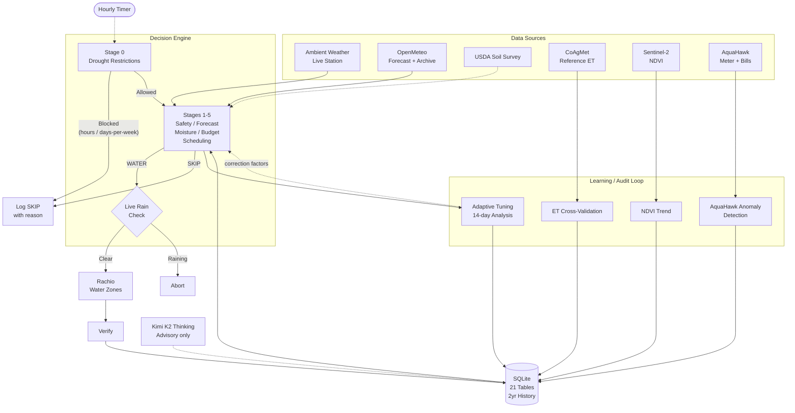

# Taproot

Smart Irrigation System.

Standalone controller that takes over scheduling for a Rachio sprinkler system. Uses your weather station, USDA soil survey, satellite vegetation imagery, reference ET cross-validation, multi-day forecasting, your utility meter portal, historical billing data, and AI-powered insights to make watering decisions that Rachio's cloud cannot — including enforcing local drought restrictions.

Fully deterministic decision engine. AI layer is advisory only — it never changes watering decisions.


## Data sources

Seven external sources, cross-validated against each other, stored in SQLite for 2-year historical analysis:

| Source | Data | Auth | Frequency |
| ------ | ---- | ---- | --------- |
| **Ambient Weather** | Live temperature, humidity, wind, rain, solar radiation | API key | Every run |
| **OpenMeteo** | 7-day forecast + 2-year daily archive (temp, rain, solar, wind, FAO-56 reference ET) | None | Daily + backfill |
| **USDA Soil Data Access** | Soil type, available water capacity, pH, organic matter, infiltration rate | None | Once (cached) |
| **CoAgMet** | Reference evapotranspiration from nearest Colorado ag weather station | None | Daily + 2-year backfill |
| **Sentinel-2 Satellite** | 10-meter NDVI vegetation health imagery | Copernicus account | Every 5 days |
| **AquaHawk (UtilityHawk)** | Hourly meter readings, bills, rainfall/temperature at the meter | Session cookie | Daily + 2-year backfill |
| **Rachio API** | Zone control, run verification, device status | API key | Every run |

## Architecture



## Decision pipeline

Every hour, 6-stage deterministic pipeline:

1. **Drought restrictions** — Enforces local utility rules (allowed hours, days-per-week per zone, exempt zone types). Always wins over everything below.
2. **Safety** — Skip on high wind, recent rain, or sub-freezing temps.
3. **Forecast** — Skip if forecast rainfall exceeds threshold.
4. **Soil moisture** — Per-zone water deficit via ET modeling from archived, forecast, and live weather.
5. **Budget** — Daily gallon and cost caps from your utility's tiered rates. If total demand exceeds the cap, waters the most-urgent zones that fit (partial run) rather than skipping everything.
6. **Scheduling** — Optimized run with soak cycles for clay soil infiltration.

Post-decision integrations run automatically:

- **ET cross-validation** against CoAgMet reference measurements
- **NDVI refresh** from Sentinel-2 if last reading > 5 days old
- **Adaptive tuning** with 14-day rolling analysis and auto-correction
- **AquaHawk anomaly detection** — 10x trailing-median flow flagged at ERROR level (catches leaks and stuck zones within 24 hours)

Final live rain check before any command is sent. Verify step confirms Rachio accepted.

## Comparison

| | Taproot | [HAsmartirrigation](https://github.com/jeroenterheerdt/HAsmartirrigation) | [homebridge-smart-irrigation](https://github.com/MTry/homebridge-smart-irrigation) | [OpenSprinkler Weather](https://github.com/OpenSprinkler/OpenSprinkler-Weather) |
| --- | :---: | :---: | :---: | :---: |
| **Standalone** | Yes | No (HA) | No (Homebridge) | No (OpenSprinkler HW) |
| **Rachio API control** | Yes | No | No | No |
| **Local weather station** | Yes | No | No | No |
| **Weather cross-validation** | Yes | No | No | No |
| **Real-time rain abort** | Yes | No | No | No |
| **Drought-restriction enforcement** | Yes (per-zone, per-hour) | No | No | No |
| **Utility meter ground truth** | Yes (AquaHawk) | No | No | No |
| **Bill reconciliation** | Yes | No | No | No |
| **Anomaly / leak detection** | Yes (10x median) | No | No | No |
| **Predicted vs actual auditing** | Yes | No | No | No |
| **Satellite vegetation health** | Yes (Sentinel-2) | No | No | No |
| **USDA soil integration** | Yes | No | No | No |
| **Reference ET validation** | Yes (CoAgMet) | No | No | No |
| **AI insights** | Yes (Kimi K2) | No | No | No |
| **Natural language chat** | Yes | No | No | No |
| **Adaptive zone tuning** | Yes | Yes | No | No |
| **ET method** | Hargreaves + CoAgMet | FAO-56 PyETo | Penman-Monteith | ETo % scaling |
| **Per-zone moisture budget** | Yes | Yes | No | No |
| **Smart soak cycles** | Yes | No | No | No |
| **Utility rate tracking** | Yes (YAML + historical regimes) | No | No | No |
| **2-year historical data** | Yes | No | No | No |
| **MQTT / Home Assistant** | Optional | Native | Native | No |

## Features

**Shadow mode.** Run for a week before going live. All decisions are logged without actuating Rachio. When you're confident, `taproot go-live` flips the switch.

**Drought-stage enforcement.** Configurable `restrictions.yaml` enforces allowed watering windows, max days per week per zone, exempt zone types (drip), and address-specific day-of-week assignments. Ships with a Golden Colorado Stage 1 template. Restrictions always win over scheduling.

**AquaHawk meter integration.** Pulls hourly meter readings from any municipal utility running the AquaHawk / UtilityHawk portal. 2-year backfill lands ~17,500 hourly + 730 daily + 24 monthly rows. Gives you real billed-usage numbers alongside Taproot's modeled numbers.

**Bill reconciliation.** Parses utility bills, extracts usage + tier breakdowns + fees, tracks rate-regime changes over time. Detects when modeled cost diverges from actual billed cost.

**Anomaly detection.** Daily scan of AquaHawk data flags any single day over 10x the trailing 30-day median as a possible leak or stuck zone. Logs at ERROR level so notifications fire. Retroactively validated against real incidents.

**Decision-Command-Verify.** Three-phase logging per run. State is never corrupted by failed commands. Watchdog catches silent failures.

**Ask Your Yard.** Natural language chat powered by Kimi K2 Thinking. Answers grounded in live data, 2-year weather archive, reference ET, satellite vegetation, AquaHawk meter readings, and bill history.

**Decision storytelling.** Explain button on each Run History row generates a cached plain-English narrative.

**Satellite vegetation health.** Sentinel-2 NDVI at 10m resolution. Monthly overlay view with sharp orthophoto base image. NDVI drops > 10% trigger advisor alerts.

**Reference ET cross-validation.** Daily comparison of Hargreaves ET vs CoAgMet ASCE Penman-Monteith. Persistent 15%+ deviation triggers advisor insight and auto-correction via adaptive tuning. 2-year backfill for trend analysis.

**Predicted vs Actual Usage chart.** Overlays Taproot-modeled gallons with AquaHawk meter ground truth per day. The audit view that reveals model drift.

**USDA soil integration.** Surveyed soil properties from USDA Soil Data Access API — AWC, infiltration rate, pH, organic matter, profile depth. Flags mismatches against configured values.

**Weekly intelligence briefing.** Sunday morning report with 7/14/30/90-day, seasonal, and year-over-year trends. ET accuracy score, NDVI trends, advisor insights, bill reconciliation. Kimi K2 generates structured narrative with recommendations.

**Advisor insights.** Deterministic analysis combining all data sources: forecast confidence, rain gauge bias, ET model drift, soil config mismatches, NDVI vegetation trends, flow calibration alerts, usage anomalies.

**Adaptive zone tuning.** 14-day rolling analysis of actual vs predicted watering frequency. Auto-applies ET correction factors (0.8x-1.2x bounds) after 3 consecutive same-direction suggestions.

**Home Assistant.** MQTT auto-discovery for per-zone moisture, weather data, cost, and decision state.

**Security.** CSRF tokens, 64KB body limits, login rate limiting, strict CSP (`script-src 'self'`), path traversal protection, timing-safe password comparison.

## Limitations

- Rachio cloud access required for zone actuation
- Notifications via webhook (n8n); no built-in SMTP
- Sentinel-2 requires free Copernicus Data Space account
- CoAgMet is Colorado-specific; other states need alternative reference ET source
- AquaHawk / UtilityHawk is municipal; not all utilities offer it
- 112 tests cover core logic but are not a substitute for hardware smoke testing

## Setup

### Local (dev + testing)

```bash
git clone https://github.com/jasonnickel/smart-watering-system.git ~/taproot
cd ~/taproot
npm install --production

node src/cli.js setup      # Configure API keys, zones, location
node src/cli.js doctor     # Verify connectivity
node src/cli.js web        # Start the dashboard locally
node src/cli.js run --shadow  # Test a decision cycle
```

### Homelab (production)

Taproot runs well as an unprivileged Proxmox LXC container or any Linux box with Node 20+. Systemd units are in [deploy/](deploy/):

```bash
# On the target host:
git clone https://github.com/jasonnickel/smart-watering-system.git /opt/smart-water
cd /opt/smart-water && npm install --production

# Copy systemd units, patch paths if needed, enable:
cp deploy/taproot*.service deploy/taproot*.timer /etc/systemd/system/
systemctl daemon-reload
systemctl enable --now taproot.timer taproot-summary.timer taproot-watchdog.timer taproot-briefing.timer taproot-web.service
```

Taproot stores its runtime state in `~/.taproot/`. If it finds an older `~/.smart-water` install, it automatically imports the legacy env, database, and supporting files on startup when the Taproot copies are missing.

### Historical backfill

Once API credentials are configured, pull the 2-year archive:

```bash
node src/cli.js backfill-utility --days 730   # AquaHawk meter + bills + rate history
# Weather history + reference ET:
node -e "
  import('./src/db/state.js').then(({initDB})=>initDB(process.env.HOME+'/.taproot/taproot.db'));
  import('./src/api/openmeteo.js').then(m=>m.backfillWeatherHistory({years:2}));
  import('./src/api/coagmet.js').then(m=>m.backfillReferenceET({years:2}));
"
```

### AI features

```bash
echo 'AI_API_KEY=sk-your-key-here' >> ~/.taproot/.env
echo 'AI_API_BASE_URL=https://api.moonshot.ai/v1' >> ~/.taproot/.env
echo 'AI_MODEL=kimi-k2-thinking' >> ~/.taproot/.env
```

Enables chat, decision narratives, AI-enriched alerts, weekly briefing, and daily summary narratives. ~$0.30/year at typical usage.

### Satellite imagery

```bash
echo 'COPERNICUS_EMAIL=your-email@example.com' >> ~/.taproot/.env
echo 'COPERNICUS_PASSWORD=your-password' >> ~/.taproot/.env
```

### AquaHawk meter portal

```bash
echo 'AQUAHAWK_DISTRICT=goco' >> ~/.taproot/.env        # subdomain before .aquahawk.us
echo 'AQUAHAWK_USERNAME=you@example.com' >> ~/.taproot/.env
echo 'AQUAHAWK_PASSWORD=your-password' >> ~/.taproot/.env
echo 'AQUAHAWK_ACCOUNT_NUMBER=00-000000-000' >> ~/.taproot/.env
```

Then run `node src/cli.js backfill-utility --days 730` to seed two years of meter readings.

### Drought restrictions

Copy the shipped template and enable:

```bash
cp restrictions.yaml ~/.taproot/restrictions.yaml
```

Edit `~/.taproot/restrictions.yaml`:

```yaml
enabled: true
stage: 1
max_days_per_week: 2
allowed_hours:
  - start: 18      # 6pm
    end: 10        # 10am (next day)
exempt_zone_types: [drip]
effective_from: '2026-05-01'
```

Restart or wait for next hourly cycle — restrictions apply immediately.

## API

**GET endpoints:**

| Endpoint | Description |
| -------- | ----------- |
| `/api/status` | Current system status (includes `meterUsage` summary when AquaHawk is configured) |
| `/api/charts?days=N` | Moisture, daily usage (AquaHawk), decisions, precip audits, weather history, reference ET, bills |
| `/api/soil?lat=&lon=` | USDA soil survey |
| `/api/reference-et` | Yesterday's CoAgMet reference ET |
| `/api/ndvi` | NDVI vegetation statistics |
| `/api/ndvi/image?date=&mode=` | Satellite image PNG |
| `/api/history/weather?days=730` | Historical daily weather |
| `/api/history/reference-et?days=730` | Historical reference ET |
| `/api/history/ndvi?days=730` | Historical NDVI readings |
| `/api/history/et-validation?days=730` | ET model vs reference |
| `/api/ai/status` | AI features enabled |

**POST endpoints (CSRF-protected):**

| Endpoint | Description |
| -------- | ----------- |
| `/api/ai/chat` | Natural language query |
| `/api/ai/narrative` | Decision explanation |
| `/api/ai/briefing` | Weekly intelligence briefing |
| `/api/backfill/weather` | Backfill OpenMeteo weather data |
| `/api/backfill/reference-et` | Backfill CoAgMet reference ET |

## CLI

```bash
node src/cli.js setup                           # Configure API keys and zones
node src/cli.js doctor                          # System health check (verifies AquaHawk, Rachio, Ambient, OpenMeteo)
node src/cli.js go-live                         # Shadow to live mode
node src/cli.js shadow                          # Force shadow mode
node src/cli.js smoke-test --zone 1 --minutes 1 # Live commissioning test
node src/cli.js run                             # Hourly decision cycle
node src/cli.js run --shadow                    # Shadow mode run
node src/cli.js water                           # Manual watering
node src/cli.js status                          # Current state
node src/cli.js status --json                   # Machine-readable status
node src/cli.js cleanup                         # Remove data > 90 days
node src/cli.js web                             # Start the dashboard web UI
node src/cli.js service install-web             # Install launchd/systemd unit for the web UI
node src/cli.js service status-web              # Show web startup service status
node src/cli.js backfill-utility [--days N] [--intervals I,I]
                                                # Pull historical AquaHawk meter readings
```

## Configuration

| File | Purpose |
| ---- | ------- |
| `zones.yaml` | Zone profiles — type, sun exposure, area, priority, soil profile |
| `rates.yaml` | Utility rate schedule — tiers, fixed charges, AWC threshold |
| `restrictions.yaml` | Drought / conservation rules — allowed hours, days per week, exempt types |
| `~/.taproot/.env` | API keys, location, dashboard URL, startup service, MQTT, notifications, AI config, AquaHawk creds |
| `~/.taproot/restrictions.yaml` | Per-user override of `restrictions.yaml` |
| `.env.example` | All available environment variables with inline docs |

## Development

```bash
npm test       # Node.js built-in test runner
npm run lint   # ESLint flat config
npm run check  # Lint + tests
```

## Requirements

- Node.js 20+
- Rachio controller with API access
- Ambient Weather station (recommended)
- systemd or launchd for scheduling
- Optional: MQTT broker (Home Assistant), Kimi API key (~$0.30/yr), Copernicus account (satellite), AquaHawk municipal portal

## Community

- Questions: GitHub Discussions
- Bugs: GitHub Issues
- Security: `SECURITY.md`
- License: MIT
