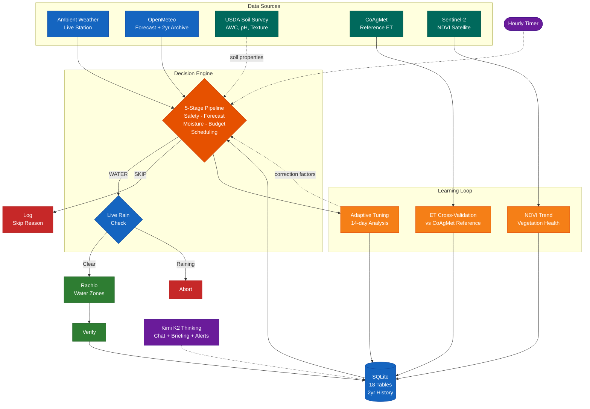

# Smart Water System

Standalone irrigation controller that takes over scheduling for a Rachio sprinkler system using your weather station data, USDA soil survey, satellite vegetation imagery, reference ET cross-validation, multi-day forecasting, and AI-powered insights via Kimi K2 Thinking. Gives you full control over the decision logic that Rachio keeps behind its app.

This repo is a working homelab-oriented controller with a full-featured web UI, AI chat interface, satellite NDVI timeline, adaptive tuning backed by ground-truth data, and multi-period trend analysis. The core decision engine is fully deterministic - the AI layer is advisory only and never changes watering decisions.

## Data Sources

The system ingests data from six external sources, cross-validates them against each other, and stores everything in SQLite for historical analysis:

| Source | What it provides | Auth | Update frequency |
| ------ | ---------------- | ---- | --------------- |
| **Ambient Weather** | Live temperature, humidity, wind, rain, solar radiation | API key | Every run |
| **OpenMeteo** | 7-day forecast + 2-year daily archive (temp, rain, solar, wind, FAO-56 reference ET) | None | Daily + backfill |
| **USDA Soil Data Access** | Soil type, available water capacity, pH, organic matter, infiltration rate for your address | None | Once (cached) |
| **CoAgMet** | Reference evapotranspiration from nearest Colorado ag weather station, for cross-validating the ET model | None | Daily + 2-year backfill |
| **Sentinel-2 Satellite** | 10-meter NDVI vegetation health imagery and statistics, true color photos | Free Copernicus account | Every 5 days |
| **Rachio API** | Zone control, run verification, device status | API key | Every run |

## How It Works



## What it does

Every hour, the system checks whether your lawn needs water by running a five-stage decision pipeline:

1. **Safety** - Skip if wind is too high, it rained recently, or temperatures are below the configured floor
2. **Forecast** - Skip if forecast rainfall exceeds the configured threshold
3. **Soil moisture** - Calculate per-zone water deficit using evapotranspiration (ET) modeling driven by archived, forecast, and live weather inputs
4. **Budget** - Enforce daily gallon and cost limits based on your utility's tiered water rates
5. **Scheduling** - Build an optimized run with smart soak cycles for clay soil infiltration

After the decision, the system runs data integrations:

- **ET cross-validation:** Compares the calculated ET against CoAgMet's measured reference ET and logs any deviation
- **NDVI refresh:** Fetches fresh satellite vegetation data if the last reading is older than 5 days
- **Adaptive tuning:** Analyzes 14-day watering patterns and adjusts ET correction factors when the model drifts

If watering is needed, a final real-time rain check confirms it's not actively raining right now. Then the system sends the command to Rachio, verifies it was accepted, and updates all state.

## How It Compares

| | Smart Water | [HAsmartirrigation](https://github.com/jeroenterheerdt/HAsmartirrigation) | [homebridge-smart-irrigation](https://github.com/MTry/homebridge-smart-irrigation) | [OpenSprinkler Weather](https://github.com/OpenSprinkler/OpenSprinkler-Weather) |
| --- | :---: | :---: | :---: | :---: |
| **Standalone** (no platform required) | Yes | No (Home Assistant) | No (Homebridge) | No (OpenSprinkler HW) |
| **Rachio API control** | Yes | No | No | No |
| **Local weather station** (primary source) | Yes | No | No | No |
| **Weather fallback chain** | Yes | No | No | No |
| **Weather cross-validation** | Yes | No | No | No |
| **Real-time rain abort** | Yes | No | No | No |
| **AI-powered insights** | Yes (Kimi K2) | No | No | No |
| **Natural language chat** | Yes | No | No | No |
| **Satellite vegetation health** | Yes (Sentinel-2) | No | No | No |
| **USDA soil data integration** | Yes | No | No | No |
| **Reference ET cross-validation** | Yes (CoAgMet) | No | No | No |
| **Adaptive zone tuning** | Yes | No | No | No |
| **ET method** | Hargreaves + CoAgMet validation | FAO-56 PyETo | Penman-Monteith | ETo % scaling |
| **Per-zone soil moisture budget** | Yes | Yes | No | No |
| **Smart soak cycles** | Yes | No | No | No |
| **Configurable utility rates** | Yes (YAML) | No | No | No |
| **Dark mode** | Yes | N/A | N/A | No |
| **MQTT / HA integration** | Optional | Native | Native | No |
| **Weekly intelligence briefing** | Yes | No | No | No |
| **2-year historical data** | Yes | No | No | No |

## Rachio's Problems, Our Solutions

This project is aimed at homeowners who want an inspectable, self-hosted decision engine for common smart-irrigation pain points: stale weather data, opaque skip decisions, cloud dependency, and limited observability.

### "It watered during a thunderstorm"

**The Rachio problem:** Weather Intelligence evaluates conditions 12 hours and 1 hour before a scheduled run. Rain that starts within that final window does not trigger a skip.

**Our solution:** A live rain check hits your Ambient Weather station between the DECIDE and COMMAND phases of every run. If any measurable rainfall is detected (hourly rain > 0.02" or daily accumulation exceeds the skip threshold), the run is aborted. The system will never send water to your yard while it's already raining.

### "Weather Intelligence said 0.14 inches when my gauge read 0.35"

**The Rachio problem:** Rachio routes weather data through Aeris Weather. Users report significant precipitation discrepancies with no way to see which source was used.

**Our solution:** Every day, the system cross-validates precipitation readings between your Ambient Weather station and OpenMeteo's archive data. Discrepancies are logged with both values and what was used. The daily summary highlights repeated high-discrepancy days so you can investigate rain gauge drift.

### "My station went offline and Rachio never told me"

**The Rachio problem:** When a weather station goes offline, Rachio silently falls back to distant stations with no notification.

**Our solution:** The system tracks weather station staleness with escalating alerts at 4, 12, and 24 hours. When `AI_API_KEY` is configured, watchdog alerts are enriched with context explaining what the system is doing about it, current soil moisture, and whether you need to act.

### "Flex Daily went 8 days without watering in 100-degree heat"

**The Rachio problem:** Flex Daily's ET model uses fixed parameters that don't account for extreme conditions. Users report multi-day watering gaps during 100F+ temperatures.

**Our solution:** Four layers of protection:

- **Emergency cooling** with dynamic temperature triggers adjusted for solar radiation, humidity, and wind.
- **Degraded-mode policy** that never skips watering in summer because a data source is unavailable.
- **Adaptive zone tuning** that compares actual watering frequency against predicted frequency over 14-day windows and auto-corrects ET factors when the model drifts.
- **Reference ET cross-validation** that compares the system's Hargreaves calculations against CoAgMet's ASCE Penman-Monteith measurements daily. When the model is consistently 15%+ off, the advisor flags it and the tuning system compensates.

### "I have no idea why it did that"

**The Rachio problem:** The app shows what happened but not why. Skip reasons are generic.

**Our solution:** Every run is logged across three phases (DECIDE, COMMAND, VERIFY). When `AI_API_KEY` is configured, the Run History page adds an "Explain" button on each decision row - Kimi K2 Thinking generates a plain English narrative cached in the database. "Ask Your Yard" on the dashboard lets you type any question and get answers grounded in your live data, 2-year weather archive, soil survey, ET validation history, and satellite vegetation health.

### "I don't know my precipitation rates and I'm not doing catch cup tests"

**The Rachio problem:** Flex Daily depends on precipitation rate calibration most users never do, leading to absurd schedules.

**Our solution:** The USDA Soil Data Access API returns surveyed soil properties for your exact address - available water capacity, infiltration rate, pH, organic matter - replacing guesswork with ground truth. The system compares configured AWC against USDA data and flags mismatches. The adaptive tuning system compensates for remaining calibration errors by adjusting ET correction factors based on observed watering patterns.

## Key Features

**Shadow mode.** Before going live, the system runs in shadow mode - makes all decisions and logs them, but doesn't actually send commands to Rachio. Run for a week to validate decisions before activating.

**Decision-Command-Verify.** Every watering run is logged in three phases. The decision is recorded before any command is sent. If Rachio rejects the command or doesn't respond, state is not corrupted. The watchdog catches silent failures.

**Ask Your Yard.** A natural language chat box on the dashboard powered by Kimi K2 Thinking Turbo. Ask questions in plain English - "Why didn't you water yesterday?", "Which zone is driest?", "How much have I spent this month?" - and get answers grounded in your live data, 2-year weather archive, reference ET history, and satellite vegetation readings.

**Decision storytelling.** Each row in Run History has an "Explain" button that generates a plain English narrative using Kimi K2 Thinking Turbo. Narratives are cached in the database so the same row never costs another API call.

**Satellite vegetation health.** Sentinel-2 satellite imagery at 10-meter resolution showing your yard's vegetation health over time. Three comparison modes: week-to-week (12 weeks), month-to-month (12 months), year-to-year (2 years quarterly). Choose between NDVI-enhanced view (vegetation pops green, stress shows yellow/brown) or true-color satellite photos. NDVI statistics feed into the advisor - when vegetation health drops 10%+ between observation periods, the system flags it.

**Reference ET cross-validation.** Every daily run compares the system's Hargreaves ET calculation against the ASCE Penman-Monteith reference ET measured at the nearest CoAgMet station. Deviations are logged to the `et_validation` table. When the model runs 15%+ off for 14+ days, the advisor generates an insight and the tuning system compensates. 2 years of historical reference ET are backfilled for trend analysis.

**USDA soil data integration.** Queries the USDA Soil Data Access API for surveyed soil properties at your address: soil series name, available water capacity, infiltration rate, pH, organic matter, and profile depth. Compares against configured values and flags mismatches. Data is cached in the database.

**Weekly intelligence briefing.** A Sunday morning report with multi-period trend analysis: 7-day, 14-day, 30-day, 90-day, full season, and year-over-year. Includes ET model accuracy score, NDVI vegetation trend, and all advisor insights. Kimi K2 Thinking generates a structured narrative with headline, trends, and actionable recommendations. Available on-demand from the Briefing tab.

**Advisor insights.** Deterministic analysis shown on the dashboard combining all data sources: forecast confidence when weather sources disagree, rain gauge bias detection, ET model drift against reference measurements, soil configuration mismatches against USDA survey data, NDVI vegetation health trends from satellite, and flow calibration alerts.

**AI-enriched notifications.** Watchdog alerts are transformed from raw messages into context-aware notifications explaining what the system is doing, current soil moisture, and whether you need to act.

**Adaptive zone tuning.** 14-day rolling analysis compares actual watering frequency against predicted frequency. When a zone waters 30%+ more or less than expected, the system suggests an ET correction factor. After 3 consecutive same-direction suggestions, the correction auto-applies within safe bounds (0.8x-1.2x). Cross-validated against CoAgMet reference ET so corrections are grounded in measured data.

**2-year historical archive.** OpenMeteo weather data (temperature, rain, solar radiation, wind, FAO-56 reference ET) and CoAgMet reference ET are backfilled for 2 years and stored in SQLite. All historical data is queryable via API endpoints and available to the AI chat, briefing, and advisor modules.

**Configurable water rates.** Your utility's tiered rate schedule lives in `rates.yaml`. Supports AWC-based tier structures (like City of Golden, CO), monthly fixed charges (base fee, wastewater, drainage), and multi-tier volume pricing. Update the file when rates change, no code changes needed.

**Dark mode.** Full dark theme with automatic OS preference detection and a manual toggle button in the header. Preference persists in localStorage.

**Daily summary job.** A 6am systemd timer generates an HTML morning report with overnight activity, soil moisture, forecast, weather source status, cost, discrepancy warnings, advisor insights, and AI narrative.

**Responsive web UI.** PWA-capable local web UI with sticky header, 44px touch targets, single-column mobile layout, and dark mode. Pages: Dashboard, Run History, Zones, Charts, Briefing, Satellite, Settings, Guided Setup.

**Home Assistant integration.** Publishes retained MQTT messages after every run: per-zone moisture percentages, weather data with source, daily/monthly cost, and last decision. HA auto-discovery creates sensor entities automatically.

**Security hardened.** CSRF tokens on all POST forms, 64KB body size limits, login rate limiting (5 attempts, 15-minute lockout), Content-Security-Policy headers, path traversal protection, timing-safe password comparison, and newline injection prevention.

## Current Limitations

- Rachio cloud access is still required to start watering runs.
- Notification delivery currently goes through n8n-style webhooks; built-in SMTP delivery is not implemented.
- Flow-meter-assisted calibration is scaffolded but requires an EveryDrop meter.
- Sentinel-2 satellite imagery requires a free Copernicus Data Space account.
- CoAgMet stations are Colorado-specific; users outside Colorado would need an alternative reference ET source (gridMET works for all of CONUS but is not yet integrated).
- The test suite (112 tests) covers core logic, web UI, auth, AI integration, finance, and routing, but is not a substitute for a live smoke test against your own hardware.

## Project Structure

```text
src/
  cli.js              Entry point - run/water/status/cleanup commands
  web.js              Web UI bootstrap (server setup only)
  briefing-runner.js   Weekly intelligence briefing runner (Sunday 7am)
  config.js            Configuration with env var support
  weather.js           Weather coordinator with cross-validation and fallback
  watchdog.js          Missed-run alert checker with AI enrichment
  summary.js           Daily HTML summary generator with AI narrative
  status-page.js       Static HTML status page generator
  notify.js            Notification dispatch (webhook delivery)
  mqtt.js              MQTT publisher for Home Assistant
  time.js              Local timezone helpers (America/Denver)
  log.js               Structured logger for systemd journal
  yaml-loader.js       YAML zone, rate, and soil config loader
  env.js               Environment file read/write helpers
  explain.js           Plain English decision explanations
  web-forms.js         Form data parsing and zone config serialization
  ai/
    advisor.js         Deterministic insights + Kimi K2 API client
    chat.js            Ask Your Yard - natural language data queries
    narratives.js      Decision storytelling with DB caching
    notifications.js   Context-aware alert enrichment
    briefing.js        Multi-period trend analysis and YoY comparison
  web/
    auth.js            Session auth, CSRF tokens, rate limiting
    html.js            HTML helpers, layout shell, dark mode toggle
    pages.js           Page renderers (dashboard, logs, zones, charts, briefing, satellite, settings, setup, login)
    routes.js          HTTP handler, route dispatch, security headers, data APIs
  core/
    et.js              Evapotranspiration calculations (Hargreaves variant)
    soil-moisture.js   Per-zone moisture balance tracking with ET corrections
    rule-engine.js     5-stage decision engine
    soak.js            Smart soak cycle builder
    finance.js         Tiered cost calculations with AWC support and breakdown
    tuning.js          Adaptive zone tuning with 14-day rolling analysis
    data-integration.js  Orchestrates ET validation, soil config, and NDVI refresh
  api/
    rachio.js          Rachio API client (zones, profiles, commands, flow)
    ambient.js         Ambient Weather API client (current + live rain check)
    openmeteo.js       OpenMeteo API client (archive + forecast + 2yr backfill)
    coagmet.js         CoAgMet reference ET client (daily + 2yr backfill)
    usda-soil.js       USDA Soil Data Access client (SSURGO survey by lat/lon)
    ndvi.js            Sentinel-2 NDVI satellite client (stats + images + timeline)
    http.js            Shared fetch with retry and timeout
  db/
    schema.sql         SQLite table definitions (18 tables + 7 indexes)
    state.js           All database read/write operations
  public/
    styles.css         Cacheable CSS with light/dark themes
    theme.js           Dark mode toggle with localStorage persistence
    ai.js              Client-side chat, narrative expansion, briefing UI
    satellite.js       Satellite NDVI timeline viewer
    manifest.json      PWA manifest
    sw.js              Service worker for offline support
    icon-192.svg       App icon (small)
    icon-512.svg       App icon (large)
zones.yaml             Zone configuration (edit this for your yard)
rates.yaml             Water rate schedule (edit for your utility)
backfill.js            One-time historical data backfill script
tests/                 112 tests covering core logic, finance, web UI, auth, AI, and routing
deploy/
  smart-water.service  systemd oneshot service
  smart-water.timer    Hourly timer
  smart-water-watchdog.service/timer
  smart-water-summary.service/timer
  smart-water-briefing.service/timer  Weekly intelligence briefing (Sunday 7am)
  smart-water-web.service             Persistent web UI server
  install.sh           Deployment script
  auto-update.sh       Git-based auto-deploy (polls every 2 minutes)
  n8n-workflows/       n8n integration design
eslint.config.js       ESLint flat config - catches real bugs, no style opinions
```

## Requirements

- Node.js 20+
- SQLite (via better-sqlite3)
- Rachio irrigation controller (any model with API access)
- Ambient Weather station (optional but recommended)
- systemd (for scheduling)
- n8n or another webhook receiver (optional, for notifications and summary delivery)
- MQTT broker (optional, for Home Assistant)
- Kimi API key from platform.moonshot.ai (optional, for AI features - ~$0.30/year)
- Copernicus Data Space account from dataspace.copernicus.eu (optional, free, for satellite imagery)

## Setup

```bash
# Clone and install
git clone https://github.com/jasonnickel/smart-watering-system.git ~/smart-water
cd ~/smart-water
npm install --production

# Interactive setup (asks for API keys, writes config for you)
node src/cli.js setup

# Verify everything is connected
node src/cli.js doctor

# Optional: open the local browser UI at http://127.0.0.1:3000
node src/cli.js web

# Test in shadow mode (default - logs decisions, doesn't actuate)
node src/cli.js run --shadow

# Install systemd timers for automatic scheduling
bash deploy/install.sh

# After a week of shadow runs, go live
node src/cli.js go-live

# Optional: run one short live smoke test on a single zone
node src/cli.js smoke-test --zone 1 --minutes 1

# View logs
journalctl -u smart-water -f
```

### AI Features (Optional)

```bash
# Get a free API key from platform.moonshot.ai
# Add to your env file:
echo 'AI_API_KEY=sk-your-key-here' >> ~/.smart-water/.env
echo 'AI_API_BASE_URL=https://api.moonshot.ai/v1' >> ~/.smart-water/.env
echo 'AI_MODEL=kimi-k2-thinking' >> ~/.smart-water/.env

# Restart the web UI to enable:
#   - Ask Your Yard chat on the dashboard
#   - Decision storytelling in Run History
#   - AI-enriched watchdog alerts
#   - Weekly intelligence briefing with AI narrative
#   - AI narrative in daily summary emails
```

AI costs approximately $0.30/year at typical usage (one daily summary call + occasional chat questions and narrative generation).

### Satellite Imagery (Optional)

```bash
# Sign up for a free account at dataspace.copernicus.eu
# Add to your env file:
echo 'COPERNICUS_EMAIL=your-email@example.com' >> ~/.smart-water/.env
echo 'COPERNICUS_PASSWORD=your-password' >> ~/.smart-water/.env

# Enables the Satellite tab with NDVI vegetation health timeline
# and feeds NDVI trends into advisor insights and weekly briefing
```

### Water Rate Configuration

```bash
# Edit rates.yaml to match your utility's rate schedule
# The default is configured for City of Golden, CO (2026 rates)
# Update when your utility publishes new rates - no code changes needed
vi rates.yaml
```

### Historical Data Backfill

```bash
# Backfill 2 years of weather and reference ET data
# Run once after initial setup - takes about 30 seconds
node backfill.js
```

This populates:

- 730 days of OpenMeteo daily weather (temp, rain, solar, wind, FAO-56 reference ET)
- 730 days of CoAgMet reference ET from the nearest station
- USDA soil survey for your address (cached permanently)

## API Endpoints

**Data queries (GET):**

| Endpoint | Description |
| ---------- | ------------- |
| `/api/status` | Current system status (JSON) |
| `/api/charts` | Moisture history for charts |
| `/api/soil?lat=&lon=` | USDA soil survey for a location |
| `/api/reference-et` | Yesterday's CoAgMet reference ET |
| `/api/ndvi` | NDVI vegetation statistics (90 days) |
| `/api/ndvi/image?date=&mode=` | Satellite image PNG (ndvi or truecolor) |
| `/api/history/weather?days=730` | Historical daily weather |
| `/api/history/reference-et?days=730` | Historical reference ET |
| `/api/history/ndvi?days=730` | Historical NDVI readings |
| `/api/history/et-validation?days=730` | ET model vs reference comparison |
| `/api/ai/status` | Whether AI features are enabled |

**Actions (POST, CSRF-protected):**

| Endpoint | Description |
| ---------- | ------------- |
| `/api/ai/chat` | Ask Your Yard natural language query |
| `/api/ai/narrative` | Generate decision explanation |
| `/api/ai/briefing` | Generate weekly intelligence briefing |
| `/api/backfill/weather` | Backfill historical weather data |
| `/api/backfill/reference-et` | Backfill CoAgMet reference ET |

## Commands

**Getting started:**

| Command | Description |
| --------- | ------------- |
| `node src/cli.js setup` | Interactive wizard - configures API keys and zones |
| `node src/cli.js doctor` | Check system health, connectivity, and recent activity |
| `node src/cli.js go-live` | Safety-checked switch from shadow to live mode |
| `node src/cli.js shadow` | Force the system back into shadow mode |
| `node src/cli.js smoke-test --zone 1 --minutes 1` | Optional short live commissioning test for one zone |

**Daily operations:**

| Command | Description |
| --------- | ------------- |
| `node src/cli.js run` | Run the hourly decision cycle |
| `node src/cli.js run --shadow` | Shadow mode (log decisions, don't actuate) |
| `node src/cli.js water` | Manual watering (overrides forecast/budget, respects safety) |
| `node src/cli.js status` | Current moisture, usage, and last run |
| `node src/cli.js status --json` | Machine-readable status for n8n/scripts |
| `node src/cli.js web` | Local browser UI with all pages |
| `node src/cli.js cleanup` | Remove data older than 90 days |

## Development

```bash
# Run the test suite (112 tests, Node.js built-in test runner)
npm test

# Lint the codebase (ESLint flat config, zero style opinions)
npm run lint

# Run lint + tests together
npm run check
```

The codebase is organized into focused modules:

- `src/web/` - auth, HTML helpers, page renderers, route dispatch (each under 500 lines)
- `src/ai/` - chat, narratives, notifications, briefing, advisor (each a single-purpose module)
- `src/core/` - ET calculations, soil moisture, rule engine, soak cycles, finance, tuning, data integration
- `src/api/` - Rachio, Ambient Weather, OpenMeteo, CoAgMet, USDA Soil, Sentinel-2 NDVI clients
- `src/public/` - CSS with dark mode, theme toggle, AI client JS, satellite viewer, PWA assets

## Configuration

- **Zone profiles:** Edit `zones.yaml` - documented YAML with comments explaining each field
- **Water rates:** Edit `rates.yaml` - your utility's tiered rate schedule, fixed charges, and AWC threshold
- **System settings:** `src/config.js` - thresholds, schedule windows, emergency triggers (loaded from YAML files at startup)
- **Secrets and location:** `~/.smart-water/.env` - API keys, MQTT broker, notification webhook, `LAT`, `LON`, `LOCATION_TIMEZONE`
- **AI features:** Set `AI_API_KEY`, `AI_API_BASE_URL`, and `AI_MODEL` in your env file
- **Satellite imagery:** Set `COPERNICUS_EMAIL` and `COPERNICUS_PASSWORD` in your env file
- **CoAgMet station:** Set `COAGMET_STATION` to override the default nearest station (default: `den01`)
- **Optional web auth:** Set `WEB_UI_PASSWORD` and restart the web UI for browser sign-in on top of localhost binding
- **See** `.env.example` for all available environment variables

## Community

- Questions and setup help: GitHub Discussions
- Bugs and feature requests: GitHub Issues
- Contribution guide: `CONTRIBUTING.md`
- Security reporting: `SECURITY.md`
- Project license: MIT (`LICENSE`)
