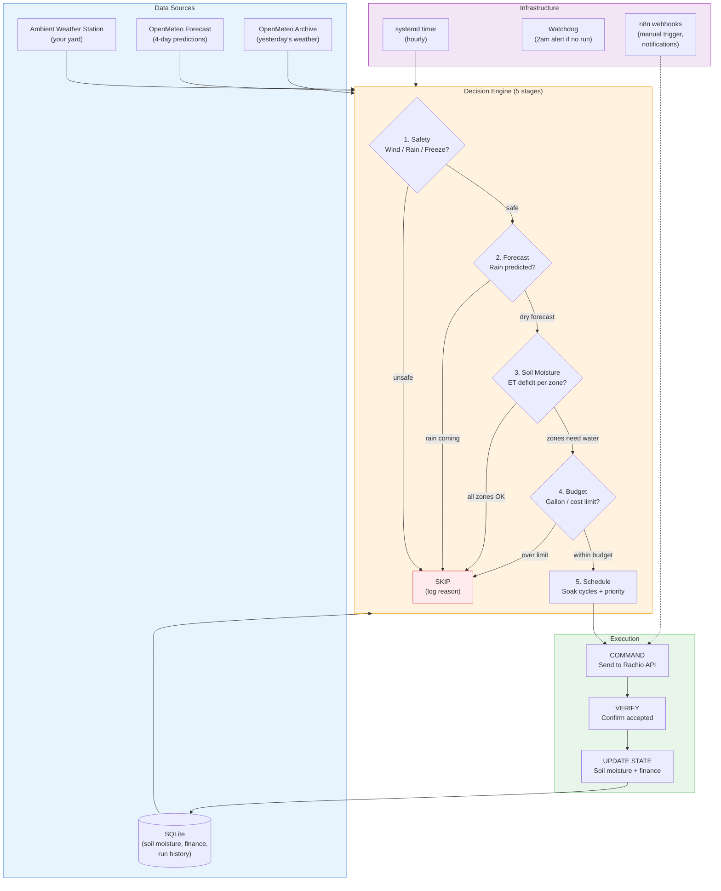
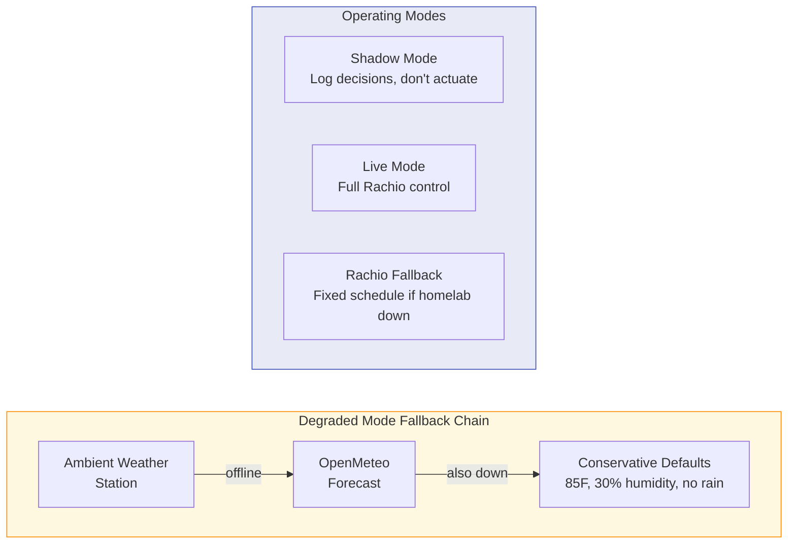

# Smart Water System

Standalone irrigation controller that manages a Rachio sprinkler system using local weather station data, scientific soil moisture modeling, and multi-day forecasting. Replaces Rachio's paid Weather Intelligence features with more accurate, hyper-local decision making.

## System Overview





## What it does

Every hour, the system checks whether your lawn needs water by running a five-stage decision pipeline:

1. **Safety** - Skip if wind is too high, it rained recently, or temps are below freezing
2. **Forecast** - Skip if significant rain is predicted in the next 24 hours
3. **Soil moisture** - Calculate per-zone water deficit using evapotranspiration (ET) modeling with data from your personal weather station
4. **Budget** - Enforce daily gallon and cost limits based on your tiered water rates
5. **Scheduling** - Build an optimized run with smart soak cycles for clay soil infiltration

If watering is needed, the system sends the command to Rachio, verifies it was accepted, and updates all state. If not, it logs the skip reason and moves on.

## Why not just use Rachio's built-in scheduling?

Rachio's free tier uses regional weather data and basic scheduling. The paid Weather Intelligence upgrade adds ET-based watering, but:

- **Your weather station is more accurate than regional data.** This system reads directly from an Ambient Weather station in your yard, capturing microclimate conditions Rachio's regional model misses.
- **Proactive forecast watering.** Uses OpenMeteo's forecast API to water before predicted hot/dry streaks, not just react to current conditions.
- **Smart soak cycles.** Splits long runs into two passes with soak intervals for Colorado clay soil - better infiltration, less runoff.
- **Emergency cooling.** Dynamic temperature triggers that account for solar radiation, humidity, and wind - more nuanced than Rachio's blunt heat threshold.
- **Cost tracking.** Calculates actual costs against your tiered water rates and enforces daily budgets.

## How it works

```
systemd timer (hourly)
  |
  smart-water CLI
    |-- Reads weather from Ambient Weather station (falls back to OpenMeteo if offline)
    |-- Calculates ET and updates soil moisture balance per zone
    |-- Runs decision engine (5 stages)
    |-- If WATER: sends command to Rachio -> verifies -> updates state
    |-- If SKIP: logs reason
    |-- All state persisted to SQLite
  |
  watchdog timer (2am daily)
    |-- Alerts if no successful run occurred in the last 24 hours

n8n (optional thin shell)
  |-- Webhook for "water now" from phone
  |-- Notification relay for email alerts
  |-- Status query endpoint
```

## Key features

**Degraded mode.** If the weather station goes offline during a heat wave, the system doesn't just skip watering. It falls back to OpenMeteo forecast data, then to conservative defaults (assume hot and dry). It will never refuse to water in summer just because an API is down.

**Shadow mode.** Before going live, the system runs in shadow mode - makes all decisions and logs them, but doesn't actually send commands to Rachio. Run for a week to validate decisions before activating.

**Decision-Command-Verify.** Every watering run is logged in three phases. The decision is recorded before any command is sent. If Rachio rejects the command or doesn't respond, state is not corrupted.

**Watchdog.** A separate systemd timer runs at 2am (one hour after the daily watering window closes). If no successful run was logged in the past 24 hours during growing season, it sends an alert.

**Dormant fallback.** A basic fixed schedule stays configured in the Rachio app on standby. If the homelab goes down entirely, manually activating this schedule provides emergency coverage.

## Project structure

```
src/
  cli.js              Entry point - handles run/water/status/cleanup commands
  config.js            All configuration (zone profiles, thresholds, rates)
  weather.js           Weather data coordinator with degraded-mode fallback
  watchdog.js          Missed-run alert checker
  log.js               Structured logger for systemd journal
  core/
    et.js              Evapotranspiration calculations (Hargreaves variant)
    soil-moisture.js   Per-zone moisture balance tracking
    rule-engine.js     5-stage decision engine
    soak.js            Smart soak cycle builder
    finance.js         Tiered cost calculations
  api/
    rachio.js          Rachio API client
    ambient.js         Ambient Weather API client
    openmeteo.js       OpenMeteo API client
    http.js            Shared fetch with retry
  db/
    schema.sql         SQLite table definitions
    state.js           All database read/write operations
tests/                 34 tests covering core logic
deploy/
  smart-water.service  systemd oneshot service
  smart-water.timer    Hourly timer
  smart-water-watchdog.service
  smart-water-watchdog.timer
  install.sh           Deployment script
  n8n-workflows/       n8n integration design
```

## Requirements

- Node.js 20+
- SQLite (via better-sqlite3)
- Rachio irrigation controller
- Ambient Weather station (optional but recommended)
- systemd (for scheduling)
- n8n (optional, for notifications and manual triggers)

## Setup

```bash
# Clone and install
git clone <repo-url> ~/smart-water
cd ~/smart-water
npm install --production

# Configure
mkdir -p ~/.smart-water
cp .env.example ~/.smart-water/.env
chmod 600 ~/.smart-water/.env
# Edit ~/.smart-water/.env with your API keys

# Test in shadow mode
node src/cli.js run --shadow

# Check status
node src/cli.js status

# Install systemd timers
bash deploy/install.sh

# View logs
journalctl -u smart-water -f
```

## Commands

| Command | Description |
|---------|-------------|
| `node src/cli.js run` | Run the hourly decision cycle |
| `node src/cli.js run --shadow` | Run in shadow mode (no Rachio commands) |
| `node src/cli.js water` | Manual watering trigger (respects safety checks) |
| `node src/cli.js status` | Show current moisture levels, usage, and last run |
| `node src/cli.js cleanup` | Remove data older than 90 days |

## Configuration

All zone profiles, thresholds, and rates are in `src/config.js`. API keys and secrets are in `~/.smart-water/.env`. See `.env.example` for all available environment variables.

## Zone profiles

The system manages 9 zones - 6 lawn (rotor heads) and 3 drip. Each zone has independently configured sun exposure, area, soil profile, and priority. Soil chemistry (organic matter, pH) modifies available water capacity for more accurate deficit calculations.
